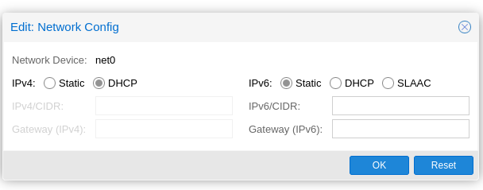

# How to build Debian10 template in proxmox

## Create a new VM in proxmox
- Click on **create vm** option.
- In the **General** tab:
  - 
  - Select the node you have multi-node cluster.
  - Give the **VM ID** ex: `901`
  - Give the **Name** ex: `debian10-template`
  - Click on **next**.

- In the **OS** tab:
  - 
  - Select **Do not use any media** option.
  - Click on **next**.

- In **System** tab:
  - Tick the **Qemu Agent** checkbox.
  - Click on **next**.

- In **Hard Disk** tab:
  - no changes for now.
  - In my `proxmox version 6.4.4` version there is no option to uncheck the harddisk option.
  - Click on **next**.
  - NOTE:- In later step we have to remove this harddisk.

- In **CPU** tab:
  - no changes.
  - Click on **next**.

- In **Memory** tab:
  - Change the value of the memory from `2048` to `1024`.
  - Click on **next**.

- In **Network** tab:
  - No changes
  - Click on **next**.

- In **Confirm** tab:
  - 
  - Click on **Finish**

### Remove the existing harddisk
- Select the machine you created.
  -  
- Go to the **Hardware** option.
  - Select the harddisk
    -  
  - Click on the **detach** option.
  - Now click on the **unused disk**
    - 
  - Click on **Remove** option.

### Create cloud init drive
- Select the machine you created.
  - 
- Go to the **Hardware** option.
  - Click on the **Add** option and select **Cloudinit drive**.
  - Then select the your storage.
    - 
  - Click on **create**.

#### Config cloud-init drive
- Now go to the **Cloud-Init**
  - 
- Now provide the value for below fields:
  - **Username**
  - **Password**
  - **SSH Public key**
- Now go the **IP config (net0)** for cloud-init
  - 
  - Click on **Edit** option
  - 
  - Select **DHCP** for ipv4 address
  - Click on **OK**

- Click on **Regenerate Image**


## Now Download and mount the debian 10 cloud image
- Do a right click on node name.
  - 

- Now download the debian10 cloud image using wget
  ```
  wget https://cloud.debian.org/images/cloud/buster/20230601-1398/debian-10-generic-amd64-20230601-1398.qcow2
  ```
- Add a serial console  to the reference vm
  ```
  qm set <VM ID> --serial0 socket --vga serial0
  ```
  - Change the **VM ID** in the above command.
  - For me its `901` so the command looks like `qm set 901 --serial0 socket --vga serial0`
- Resize the downloaded image
  ```
  qemu-img resize debian-10-generic-amd64-20230601-1398.qcow2 32G
  ```
- Import the cloud images into proxmox
  ```
  qm importdisk <VM ID> debian-10-generic-amd64-20230601-1398.qcow2 <Volume name>
  ```
  - Change the **VM ID** and **Volume name** as per your configuration.
  - For me command looks like `qm importdisk 901 debian-10-generic-amd64-20230601-1398.qcow2 local`
  - From you can see you storage name
    - 


